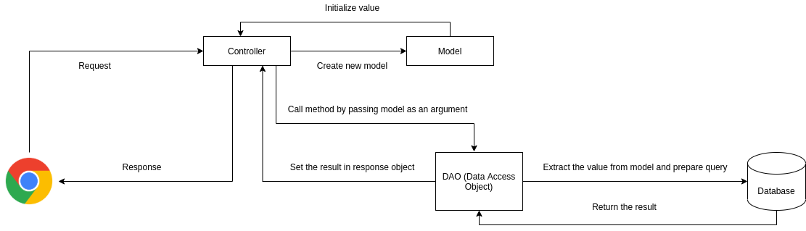

<<<<<<< HEAD
## JSP Action Tags
Used to control the flow between pages and to use Java Bean.

|JSP Action Tags | Description |
|--------------- | ----------- |
| jsp:forward | forwards the request and response to another resource | 
| jsp:include | includes another resource |
| jsp:useBean | creates or locates bean object | 
| jsp:setProperty | sets the value of the property in bean object | 
| jsp:getProperty | prints the value of property of the bean | 
| jsp:plugin | embeds another components such as applet |
| jsp:param | sets the parameter value. It is used in include and forward mostly |
| jsp:fallback | can be used to print the message if plugin is working. It is used in jsp:plugin | 
=======
## Servlet MVC
MVC pattern stands for Model-View-Controller. It is used to seperate application's concern.

* Model : Model represents an object or Java POJO carrying data. It can also have to update controller if its data changes.
* View : View represents the visualization of the data that model consists.
* Controller : Controller acts on both model and view. It controls the data flow into model object and updates the view whenever data changes. It keeps view and model seperate.

>>>>>>> bb21a9d12d14ec88558089645e3a95076c836cf9

### Prerequisite
* Java 8 or higher 
* Apache Tomcat 7.0 or higher [Download Here](https://tomcat.apache.org/download-70.cgi)
* Apache Netbeans / Netbeans / Intellij Idea   
* MySQL Server [Download Here](https://filehippo.com/download_mysql/)
* MySQL Workbench [Download Here](https://dev.mysql.com/downloads/file/?id=497505)

### Running the project 
* Clone the repository 
   
   ``git clone https://github.com/nischalshakya30/ServletDemos.git``

* Open the IDE

* Import the servlet_demos.sql to MySQL server. 

* Go the File / Open the project 

* Setup up the apache tomcat server 
  
* Run the project 

